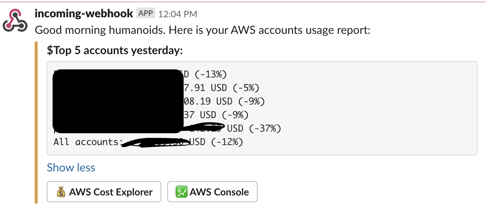
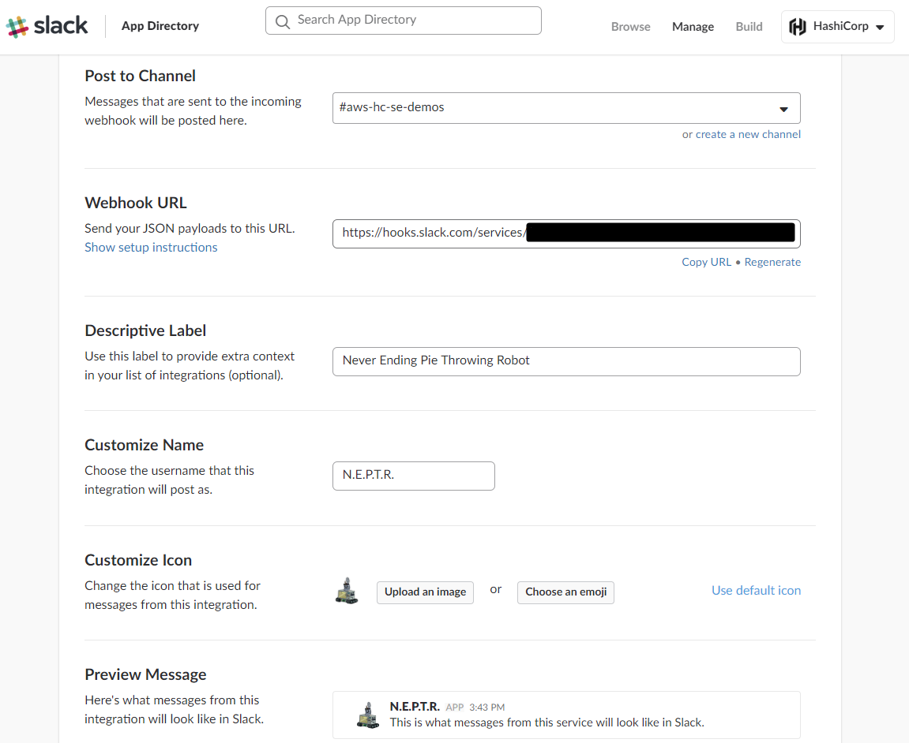
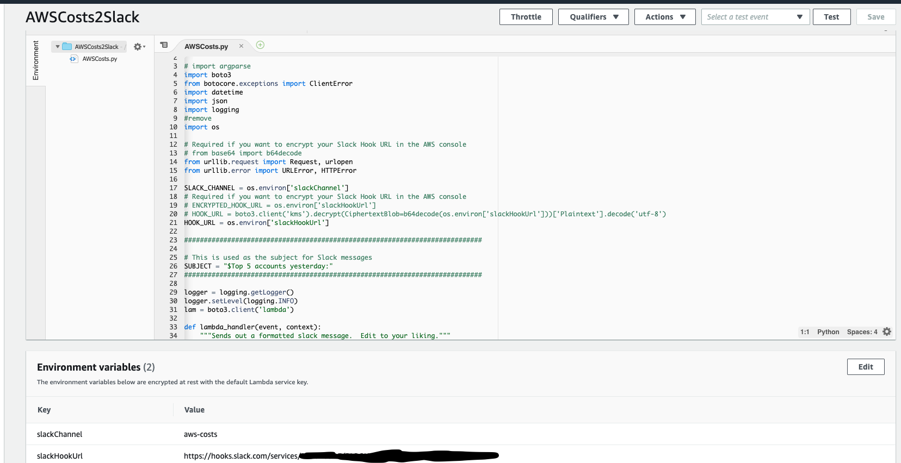

# Terraforming AWS Costs reports with AWS Lambda & Slack
Terraform configuration for AWS Costs reports.




The code and instructions contained in this directory will build lambdas to send reports to slack.


### Directory Structure
A description of what each file does:
```
 main.tf - Main configuration file.
 aws_costs.tf - Main tf file with all settings
 iam_roles.tf - Configures IAM role and policies for your Lambda functions.
 files/ - Contains all of the lambda source code, zip files.
```

## TL;DR
Below are all of the commands you'll need to run to get these lambda scripts deployed in your account:
```
# Be sure to configure your Slack webhook and edit your variables.tf file first!
terraform init
terraform plan
terraform apply
```

## Steps
The following walkthrough describes in detail the steps required to enable reports.

### Step 1: Configure incoming Slack webhook
Set up your Slack incoming webhook: https://my.slack.com/services/new/incoming-webhook/. Feel free to give your new bot a unique name, icon and description. Make note of the Webhook URL. This is a specially coded URL that allows remote applications to post data into your Slack channels. Do not share this link publicly or commit it to your source code repo. Choose the channel you want your bot to post messages to.



### Step 2: Configure your variables
Edit the `variables.tf` file and choose which region you want to run your Lambda functions in. These functions can be run from any region and manage instances in any other region.

```
variable "region" {
  default     = "us-west-2"
  description = "AWS Region"
}

variable "slack_channel" {
  default     = "#aws-costs"
  description = "Slack channel your bot will post messages to."
}

variable "slack_hook_url" {
  default = "https://hooks.slack.com/services/REPLACE/WITH/YOUR_WEBHOOK"
  description = "Slack incoming webhook URL, get this from the slack management page."
}
```

 * Set the `slack_hook_url` variable to the URL you generated in step #1.  
 * Set the `slack_channel` variable to the slack_channel you generated in step #1.
 * Save the `variables.tf` file.  

### Step 3: Run Terraform Plan

#### CLI
 * [Terraform Plan Docs](https://www.terraform.io/docs/commands/plan.html)

#### Request

```
$ terraform plan
```

#### Response
```
Refreshing Terraform state in-memory prior to plan...
The refreshed state will be used to calculate this plan, but will not be
persisted to local or remote state storage.

<Output omitted for brevity>

Plan: 25 to add, 0 to change, 0 to destroy.

------------------------------------------------------------------------

Note: You didn't specify an "-out" parameter to save this plan, so Terraform
can't guarantee that exactly these actions will be performed if
"terraform apply" is subsequently run.
```

### Step 4: Run Terraform Apply

#### CLI
 * [Terraform Apply Docs](https://www.terraform.io/docs/commands/apply.html)

#### Request

```
$ terraform apply
```

#### Response
```

  Enter a value: yes

aws_lambda_function.AWSCosts: Creating...
aws_lambda_function.AWSCosts: Creation complete after 1s [id=AWSCosts2Slack]
aws_lambda_permission.allow_cloudwatch_create_aws_costs_report: Creating...
aws_cloudwatch_event_target.awscosts_report: Creating...
aws_cloudwatch_event_target.awscosts_report: Creation complete after 0s [id=send_aws_costs_to_slack-AWSCosts2Slack]
aws_lambda_permission.allow_cloudwatch_create_aws_costs_report: Creation complete after 0s [id=AllowExecutionFromCloudWatch]
....

Apply complete! Resources: 6 added, 0 changed, 0 destroyed.
```

### Inspect deployed lambda

###  Adjust Schedule
By default the reporting lambdas are set to run once per day. You can customize the schedule by adjusting the `aws_cloudwatch_event_rule` resources. The schedule follows a Unix cron-style format: `cron(0 8 * * ? *)`.


### Clean up
Cleanup is simple, just run `terraform destroy` in your workspace and all resources will be cleaned up.
